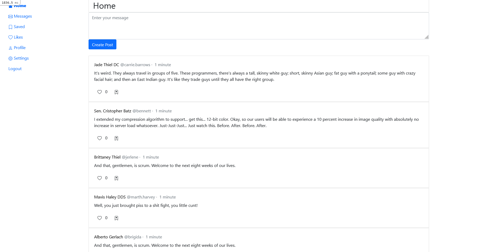
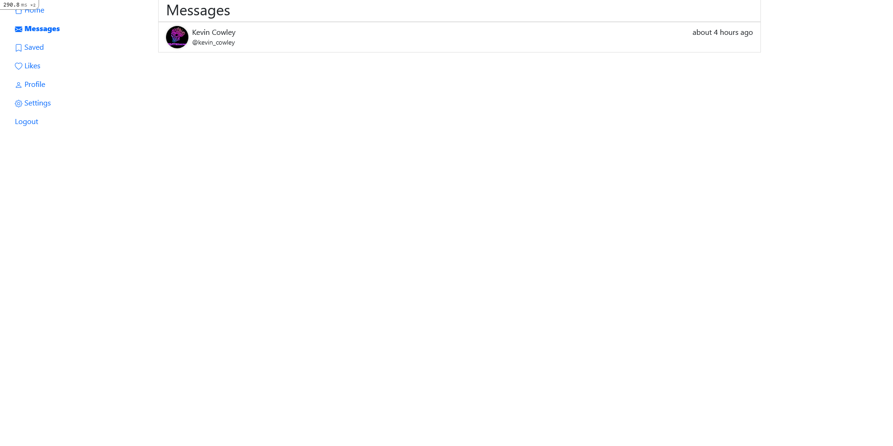
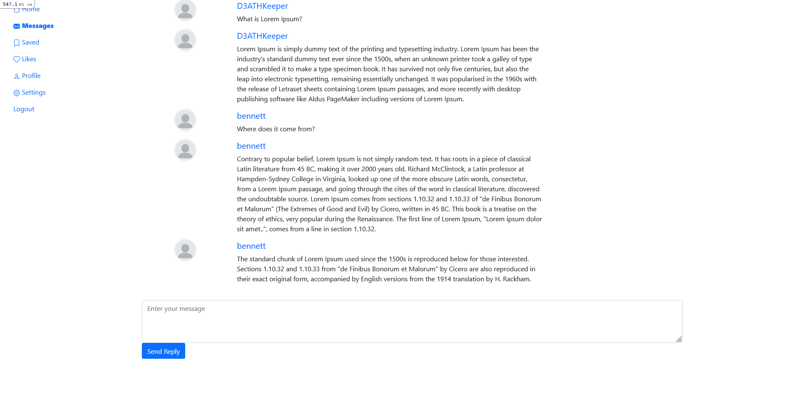
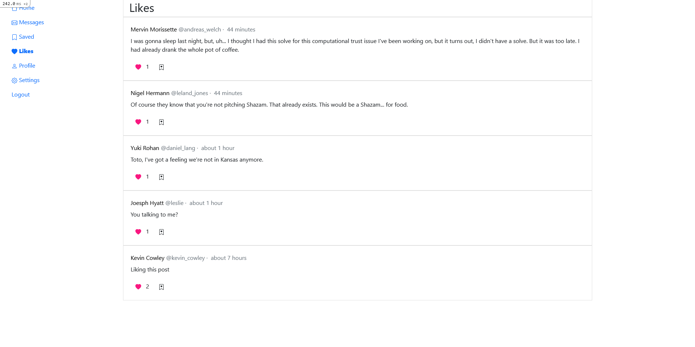
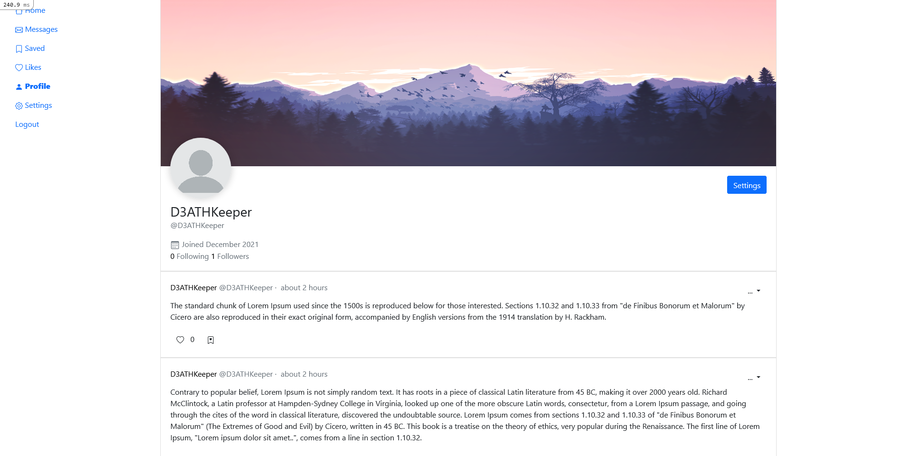
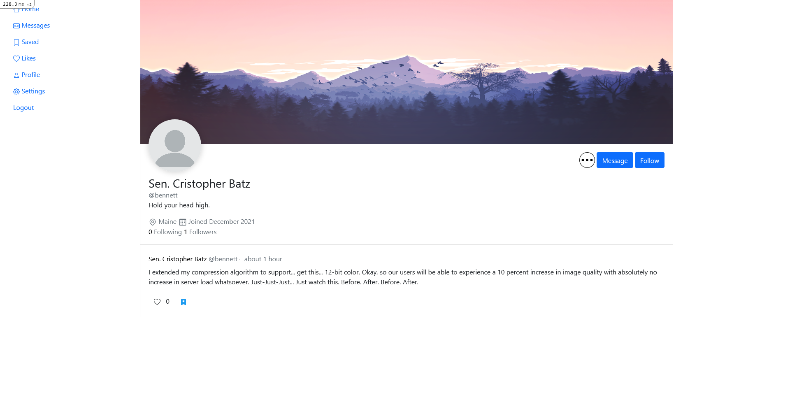
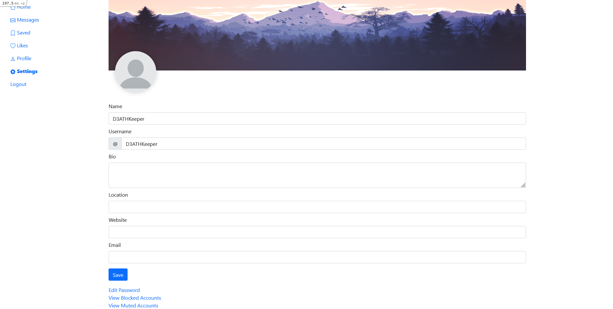

# Micro Blog


## Description

This is a demo application quickly built to replicate Twitter. My first Ruby on Rails application, there's a ton of room for improvement.

Styling also wasn't the main focus of this demo. The views are using Bootstrap to make building the application faster. The main reason for the application was to test and learn Ruby on Rails.

**Not recommended for deployment**

## Dependencies

This application requires:

* Ruby 3.0.3
* Rails 6.1.4.1

How to install [Ruby on Rails](https://www.youtube.com/watch?v=3D9d0wmwHVQ).

## Configure Application

```
bundle install
```

```
yarn
```

## Create Demo DB

```
rails db:create
```
```
rails db:migrate
```
The following command creates demo data in the DB
```
rails db:seed
```

## Start Rails Server

```
rails s
```

## Admin Account

The following details for the admin account is only available when you've finished seeding the database.

Email: `admin@fake.com`  
Password: `password`

## Images



Conversations, Blocked, Muted, Following and Follower views all look really similar




Saves and likes look the same



The avatar and banner images are the default ones.




New avatar and banner images can be uploaded when clicking the images in the settings view. Also, email removed for privacy.



## Missing Features

* Sharing
* Comments
* Tags
